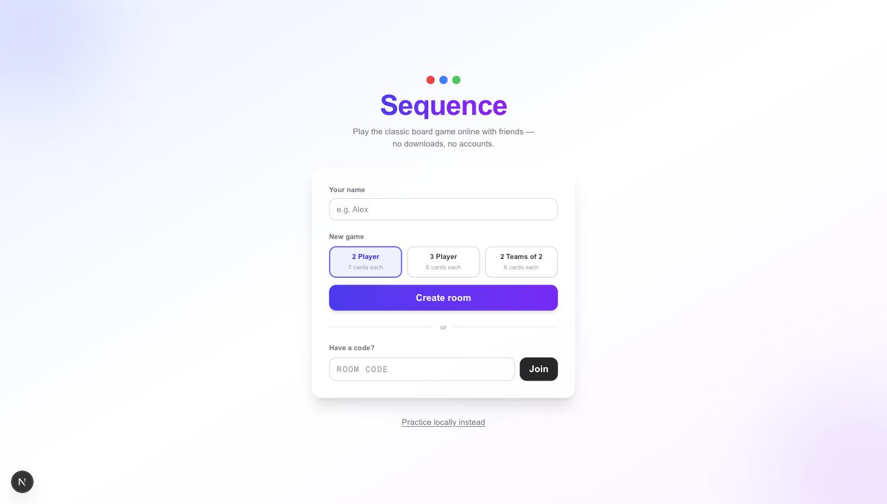
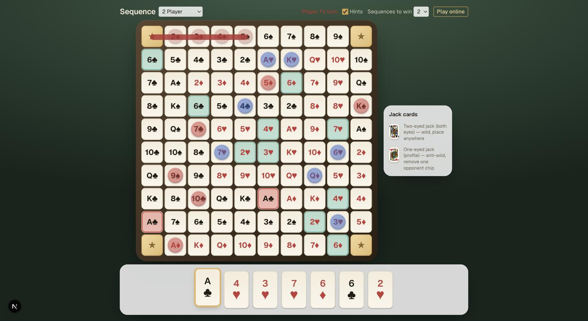
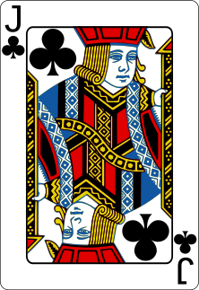
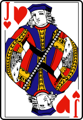

# Sequence

A web version of the classic board game **Sequence** — play online with friends
via a shareable room link, no accounts and no downloads. Also playable
hot-seat style in a single browser tab if you'd rather practice solo or pass
the device around.

**[Play it now → sequence.dizzlerai.com](https://sequence.dizzlerai.com)**



## What's here

- **2 players**, **3 players**, or **2 teams of 2**, each with correct hand
  sizes and turn order (including the team-alternating seat order: TeamA →
  TeamB → TeamA → TeamB, not team-by-team blocks)
- Live multiplayer over Supabase Realtime — join a room by a 5-character
  code, play from any device, reconnect into the same seat if you close the
  tab
- Full rules enforcement: jacks, dead cards, corner wildcards, sequence
  overlap limits, and a configurable sequences-to-win (1 or 2) for every mode
- Automatic **stalemate resolution** — if the deck runs out and nobody can
  move, the game ends by sequence count instead of hanging forever (a real
  edge case the physical rulebook doesn't spell out)
- Authentic jack artwork where the eye count actually means something: jacks
  of hearts/spades are drawn in profile (one-eyed/anti-wild), clubs/diamonds
  face forward (two-eyed/wild) — see [How jacks work](#jacks)
- Hints mode, live turn indicator, score panel, rematch flow, mobile-friendly
  layout



## How to play

### Objective

Be the first player (or team) to form the required number of **sequences** —
5 of your chips in a row, horizontally, vertically, or diagonally, with no
gaps.

### Setup

Two standard 52-card decks are shuffled together (104 cards, no jokers).
Every non-jack card appears on exactly two squares of the 10×10 board. Hand
size depends on the mode:

| Mode | Hand size |
|---|---|
| 2 players | 7 cards |
| 3 players | 6 cards |
| 2 teams of 2 | 6 cards |

### A turn

1. Play a card from your hand face-up on the discard pile.
2. Place one chip on either of that card's matching open squares. If both
   are already covered, it's a **dead card** — discard it, draw a
   replacement, and take your turn with a different card instead.
3. Draw back up to your hand size.

### Jacks

Jacks aren't on the board — they're wild cards with two different effects
depending on suit:

<a id="jacks"></a>

| | Suit | Effect |
|---|---|---|
|  | Clubs, Diamonds (two-eyed) | **Wild** — place a chip on *any* open square |
|  | Hearts, Spades (one-eyed) | **Anti-wild** — remove one opponent chip from the board (can't touch a chip that's part of an already-completed sequence, and you can't immediately place your own chip on the square you just cleared) |

This is also the origin of the "one-eyed jack" name in real card decks —
the Jack of Hearts and Jack of Spades have always been drawn in profile,
showing only one eye.

### Corners and sequences

All four corners are free for every player simultaneously and count toward
anyone's sequence — a sequence running through a corner only needs 4 chips,
not 5. Two different sequences may share at most one chip.

### Winning

By default, 2-player and 2-team games need **2 sequences** to win, while
3-player games need only **1** — though the host can toggle this to 1 or 2
for any mode before starting.

## Getting started

Just want to play? Head to
**[sequence.dizzlerai.com](https://sequence.dizzlerai.com)** — no setup
needed. The rest of this section is for running it locally.

```bash
git clone https://github.com/MuhammadAhmedMasood/sequence-game.git
cd sequence-game
npm install
```

Create a Supabase project, then apply `supabase/schema.sql` to it via the
SQL Editor (tables, RLS policies, and the RPC functions the game depends
on). Add your project's URL and anon key to a `.env.local` file:

```bash
NEXT_PUBLIC_SUPABASE_URL=your-project-url
NEXT_PUBLIC_SUPABASE_ANON_KEY=your-anon-key
```

Then:

```bash
npm run dev      # starts the app at http://localhost:3000
npm run test     # runs the game-logic test suite (Vitest)
npm run build    # production build + typecheck
```

The "Practice locally instead" link on the landing page runs a full
hot-seat game entirely in the browser, no Supabase project required — handy
for trying it out or working on game logic without any setup.

## Tech stack

[Next.js](https://nextjs.org) (App Router) · [TypeScript](https://www.typescriptlang.org)
· [Tailwind CSS](https://tailwindcss.com) ·
[Supabase](https://supabase.com) (Postgres + Realtime + Anonymous Auth) ·
[Vitest](https://vitest.dev)

## For the code-curious

### Project structure

```
lib/game/          Pure, framework-free game logic — no React, no Supabase.
                    Everything here is unit-tested and shared verbatim
                    between the local hot-seat demo and the live game.
  deck.ts             build/shuffle the 104-card deck
  deal.ts             deal hands
  board-layout.ts      the 10x10 board's card/corner layout
  moves.ts            move validation, legal-move detection, applying a move
  sequences.ts         sequence detection (corner wildcards, overlap rule)
  jacks.ts             one-eyed vs. two-eyed suit mapping
  deadCard.ts           dead-card detection
  turnOrder.ts          seating (bakes in team alternation), next-seat logic
  winCondition.ts       win detection + stalemate tie-break resolution
  __tests__/            the full test suite, including a seeded full-game
                         simulation that plays out entire games to prove the
                         game always reaches a resolved end state

lib/supabase/       Browser client, typed DB row shapes, and every query
                    (createRoom, joinRoom, startGame, playMove's persistence,
                    rematchGame, ...) in one place.

hooks/useGame.ts    The live-game data hook: subscribes to Realtime, applies
                    optimistic local updates, and layers several resilience
                    mechanisms on top (staleness guards, polling fallbacks
                    under Realtime, a reactive stalemate check) — see the
                    comments in the file for the reasoning behind each one.

app/                Landing page + local hot-seat mode (app/page.tsx), and
                    the live room UI (app/room/[roomCode]/RoomClient.tsx).

components/         Board, hand/card rendering, lobby (mode select, team
                    picker), and the score panel.

supabase/schema.sql  Tables, Row Level Security policies, and the two
                    SECURITY DEFINER RPCs that touch secret data (dealing
                    hands, drawing replacement cards). The source of truth
                    for the database — apply it via the Supabase SQL Editor.

docs/RULES.md       The authoritative rules reference this whole project is
                    built against.
```

### A few design decisions worth knowing about

- **Trust model.** Row Level Security and the two RPCs hard-enforce
  identity, turn order, and hand/deck secrecy — a player's hand is never
  sent to anyone else, and a move can only be written by whoever's turn it
  actually is. Move *content* legality (is this square really open, does
  this complete a real sequence, is this dead-card claim genuine) is
  validated by the shared `lib/game/` module running identically on every
  client, not re-checked server-side. That's a deliberate scope call for a
  casual game among friends, not a competitive product — see the comments
  in `supabase/schema.sql` for the full reasoning.
- **Realtime isn't trusted blindly.** Supabase's Postgres Changes has no
  event backlog — a client whose subscription hasn't finished joining yet
  can miss an update outright. `hooks/useGame.ts` layers a turn-number
  staleness guard (so a stale reconnect-refetch can't clobber a newer
  optimistic update) and bounded polling fallbacks under Realtime, rather
  than assuming every event always arrives.
- **Dead-card detection is occupancy-based, not history-based.** Whether a
  card is dead only depends on whether its two board squares are currently
  covered — never on *what* covered them. That single design choice is
  what makes an easy-to-miss edge case (a wild jack "spending" one of a
  card's two squares, leaving the other physical copy of that card dead
  the moment it's drawn) work correctly for free, with no special-casing.
- **A double deck's stalemate case.** If the deck runs out and the current
  player has nothing left that can end their turn, the game resolves by
  sequence count (a shared win on a tie for the lead, a full draw if every
  player is tied) instead of just sitting frozen — see
  `resolveStalemateWinners` in `lib/game/winCondition.ts`.

## Attribution

Jack card artwork is from Byron Knoll's public-domain
[Vector Playing Cards](https://github.com/notpeter/Vector-Playing-Cards)
deck — see [`public/cards/LICENSE.md`](public/cards/LICENSE.md) for details.
